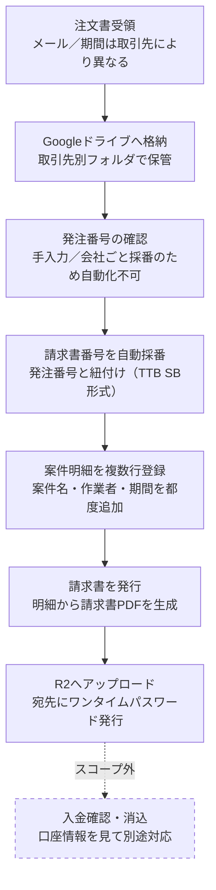

# 請求書発行業務フロー図

作成日：2026年7月15日
対象：billing（社内ドメインに沿った請求書管理・売上管理システム）

---

## フロー図

```mermaid
flowchart TD
    A[注文書受領<br>メール／期間は取引先により異なる] --> B[Googleドライブへ格納<br>取引先別フォルダで保管]
    B --> C[発注番号の確認<br>手入力／会社ごと採番のため自動化不可]
    C --> D[請求書番号を自動採番<br>発注番号と紐付け（TTB SB形式）]
    D --> E[案件明細を複数行登録<br>案件名・作業者・期間を都度追加]
    E --> F[請求書を発行<br>明細から請求書PDFを生成]
    F --> G[R2へアップロード<br>宛先にワンタイムパスワード発行]
    G -.スコープ外.-> H[入金確認・消込<br>口座情報を見て別途対応]

    style H stroke-dasharray:5,5
```

---

## 補足

- 承認フローは不要
- ロール管理は不要（認証・ユーザー管理は別システム側で保持）
- 入金確認・消込は本フローのスコープ外（別プロセス）
