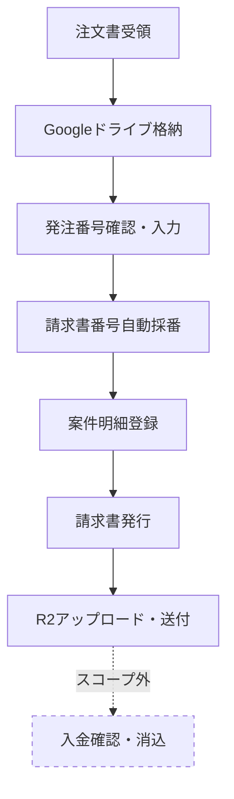

# 請求書発行業務フロー図

作成日：2026年7月15日
対象：billing（社内ドメインに沿った請求書管理・売上管理システム）

---

## フロー図

---

## 各ステップの詳細

| No. | ステップ | 内容 |
|-----|---------|------|
| 1 | 注文書受領 | メールで受領。対象期間は取引先により異なる |
| 2 | Googleドライブ格納 | 取引先別フォルダで保管 |
| 3 | 発注番号確認・入力 | 会社ごとに採番ルールが異なるため手入力（将来的にOCR化を検討） |
| 4 | 請求書番号自動採番 | 自社ルールで自動採番し、発注番号と紐付け（TTB SB形式） |
| 5 | 案件明細登録 | 1請求書IDに対し、案件名・作業者・期間等を複数行で登録 |
| 6 | 請求書発行 | 登録した明細から請求書PDFを生成 |
| 7 | R2アップロード・送付 | Cloudflare R2にアップロードし、宛先メールアドレスにワンタイムパスワードを発行 |
| 8 | 入金確認・消込（スコープ外） | 口座情報を見て別途対応（本フローの対象外） |

---

## 補足

- 承認フローは不要
- ロール管理は不要（認証・ユーザー管理は別システム側で保持）
- 入金確認・消込は本フローのスコープ外（別プロセス）
