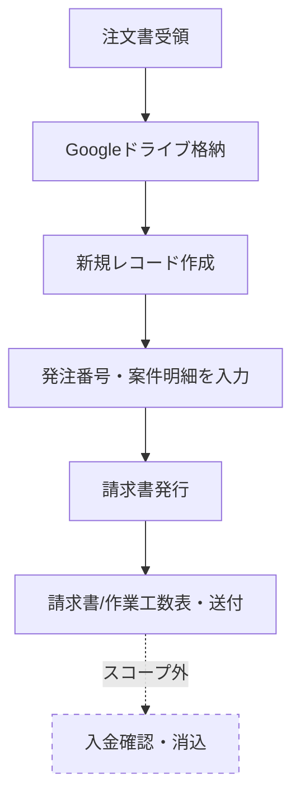

# 請求書発行業務フロー図

作成日：2026年7月15日
対象：billing（社内ドメインに沿った請求書発行システム）

---

## フロー図

---

## 各ステップの詳細

| No. | ステップ | 内容 |
|-----|---------|------|
| 1 | 注文書受領 | メールで受領。対象期間は取引先により異なる |
| 2 | Googleドライブ格納 | 取引先別フォルダで保管 |
| 3 | 新規レコード作成 | システムのUIから新規作成。この時点で請求書番号を自動採番する |
| 4 | 発注番号・案件明細を入力 | 採番済みのレコードに対し、発注番号・案件名・作業者・作業期間等を複数行で登録 |
| 5 | 請求書発行 | 登録した明細から請求書PDFを生成 |
| 6 | 請求書/作業工数表・送付 | ※方式検討事項 案①：Cloudflare R2にアップロード（ワンタイムパスワード発行） 案②：ZIPで送付 |
| 7 | 入金確認・消込（スコープ外） | 口座情報を見て別途対応（本フローの対象外） |

---

## 補足

- 承認フローは不要
- ロール管理は不要（認証・ユーザー管理は別システム側で保持）
- 入金確認・消込は本フローのスコープ外（別プロセス）
- 請求書番号の自動採番は、案件情報の入力より前（新規レコード作成のタイミング）で行う
